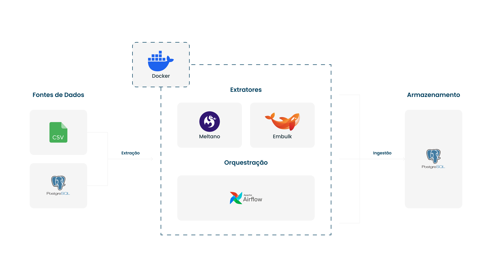

# Extração e Ingestão de Dados com Embulk, Meltano e Airflow

Este projeto demonstra a construção de um pipeline modularizado de ingestão de dados utilizando ferramentas do ecossistema de engenharia de dados. A arquitetura atual envolve extração a partir de múltiplas fontes e orquestração dos processos dentro de um ambiente containerizado com Docker.

## 🔧 Tecnologias Utilizadas

- **Embulk**: extração de dados relacionais (PostgreSQL)
- **Meltano**: planejado para leitura de dados em CSV
- **Apache Airflow**: orquestração futura dos processos de ingestão
- **Docker Compose**: empacotamento e gerenciamento dos serviços
- **PostgreSQL**: banco de dados de origem e destino
- **Makefile**: automatização de execuções
- **Shell Script**: controle de entrada e geração dinâmica dos jobs

## 📦 Estrutura de Diretórios

```bash
.
├── extract-postgres-embulk/   # Container Embulk configurado
│   ├── Dockerfile
│   ├── entrypoint.sh
│   └── scripts/create_ymls.sh
├── data/
│   ├── northwind.sql          # Dump original para recriar DB
│   ├── order_details.csv      # CSV externo a ser ingerido via Meltano
│   └── postgres/              # Dados extraídos em CSV por tabela
├── docker-compose.yml
├── Makefile
└── docs/
    └── diagrama_embulk_meltano.jpg
```

## ✅ Etapa Atual: Extração via Embulk

A primeira etapa do pipeline foi implementada com sucesso utilizando Embulk para realizar a extração de **13 tabelas do banco de dados Northwind (PostgreSQL)**. Os arquivos gerados foram salvos em `.csv`, organizados por tabela e data de execução.

* Geração dinâmica dos YAMLs (`create_ymls.sh`)
* Tratamento de permissões e readiness do banco no `entrypoint.sh`
* Comandos encapsulados via Makefile (`make extract_postgres`)
* Volume compartilhado persistente: `./data/postgres`

## 📊 Arquitetura do Pipeline

A figura abaixo representa a arquitetura atual e os componentes planejados para as próximas fases:



## 🧭 Próximos Passos

* [  ] Implementar container `extract-csv-meltano` para extração via CSV com Meltano
* [  ] Padronizar estrutura dos `taps` com plugin customizado (Singer)
* [  ] Consolidar ambos os extratores para futura ingestão em uma camada única de destino
* [  ] Orquestrar via Airflow os fluxos de extração + ingestão
* [  ] Implementar testes e validações de dados (future step)

## 📌 Comandos Úteis

```bash
make up               # Sobe todos os containers
make extract_postgres # Roda extração do banco via Embulk
make down             # Encerra containers e limpa volumes
make logs_psql        # Acessa o banco PostgreSQL no container
```

### ✍️ Autor

Matheus Vaz — [@matheusvazdata](https://github.com/matheusvazdata)